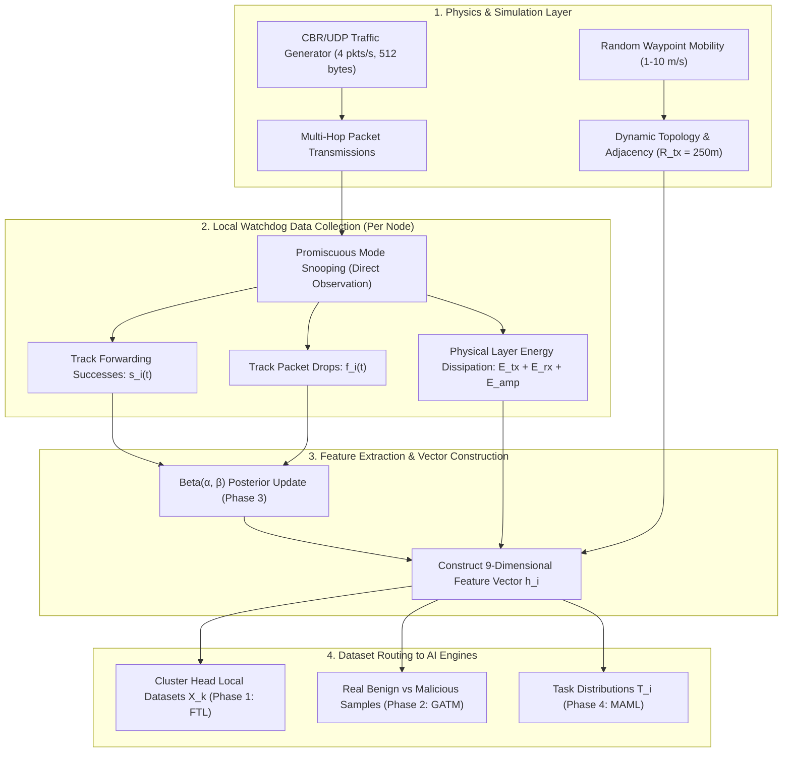

# Data Collection & Generation Methodology
## RESILIENT-MANET: Robust and Energy-Efficient Secure Routing in MANETs with Federated Adversarial Learning and Dynamic Trust Calibration

---

## 1. Overview: How Data Was Collected & Generated

In Mobile Ad Hoc Networks (MANETs), fixed static CSV/benchmark datasets cannot capture real-time mobility, time-varying link qualities, or dynamic adversarial behavior (like 20-second on-off duty cycles). 

Following the methodology established in the base literature (**Maya D. et al., *Knowledge-Based Systems*, Elsevier, 2025**), data in **RESILIENT-MANET** is generated and collected via **Autonomous Discrete-Event Simulation & Watchdog Interaction Logging** over a $1000\,\text{m} \times 1000\,\text{m}$ wireless ad hoc terrain.



---

## 2. Step-by-Step Data Collection Workflow

### Step 1: Topology & Mobility Data Generation
- **Positions ($x_i, y_i$)**: Initially generated via uniform random sampling across the $1000\,\text{m} \times 1000\,\text{m}$ area:
  $$p_i(0) = (x_i, y_i) \sim \mathcal{U}(0, 1000)^2$$
- **Mobility Updates**: Nodes choose random destination waypoints $w_i \sim \mathcal{U}(0, 1000)^2$ and speeds $v_i \sim \mathcal{U}(1.0, 10.0)\,\text{m/s}$. At each time step $\Delta t = 1.0\text{ s}$, position vectors are updated:
  $$p_i(t + \Delta t) = p_i(t) + \frac{w_i - p_i(t)}{\|w_i - p_i(t)\|} \cdot v_i \cdot \Delta t$$
- **Dynamic Neighborhood**: Every second, the Euclidean distance matrix $D_{ij} = \|p_i - p_j\|_2$ determines the active adjacency set:
  $$\mathcal{N}_i(t) = \{ j \mid j \neq i \text{ and } D_{ij} \le 250.0\,\text{m} \}$$

---

### Step 2: Traffic Flow & Watchdog Packet Logging
- **Traffic Generation**: UDP agents send Constant Bit Rate (CBR) data at **$4\text{ packets/second}$** with packet size **$512\text{ bytes}$** ($4096\text{ bits}$).
- **Watchdog Snooping**: In wireless ad hoc networks, nodes operate in promiscuous mode to overhear whether the chosen next-hop forwarder actually relays the packet:
  - If node $j$ retransmits the packet within timeout $\Delta \tau_{\text{wait}} \le 10\,\text{ms}$, observer $i$ logs a **Success** ($s_{ij} = 1$).
  - If node $j$ quietly drops the packet, observer $i$ logs a **Drop/Failure** ($f_{ij} = 1$).
- **Total Interaction Volume**: Across 100 nodes over 40 seconds, **$\approx 16,000\text{ raw forwarding observations}$** are recorded per simulation run ($160,000$ across 10 Monte Carlo runs).

---

### Step 3: Energy Dissipation Data Collection
Energy consumption is measured at the physical layer for every bit transmitted and received:
$$E_{\text{dissipated}}(k, d) = \underbrace{k \cdot E_{\text{tx}} + k \cdot \epsilon_{\text{amp}} \cdot d^2}_{\text{Transmitting } k \text{ bits over distance } d} + \underbrace{k \cdot E_{\text{rx}}}_{\text{Receiving } k \text{ bits}}$$
where $E_{\text{tx}} = 50\,\text{nJ/bit}$, $E_{\text{rx}} = 50\,\text{nJ/bit}$, and $\epsilon_{\text{amp}} = 100\,\text{pJ/bit/m}^2$. Residual energy $E_i(t)$ is decremented continuously from the initial $E_0 = 15.1\,\text{J}$.

---

### Step 4: Constructing the 9-Dimensional Node Dataset ($h_i$)
At each simulation second, raw logged observations are compiled into a normalized 9D feature vector $h_i \in [0, 1]^9$:

```python
# Raw feature calculation in resilient_manet_engine.py:
H[i, 0] = positions[i, 0] / 1000.0          # Normalized X
H[i, 1] = positions[i, 1] / 1000.0          # Normalized Y
H[i, 2] = energies[i] / 15.1                # Residual Energy Ratio
H[i, 3] = bayes_posterior_mean[i]           # Bayesian Trust μ = α / (α + β)
H[i, 4] = 1.0 - np.clip(uncertainty[i]*2, 0, 1) # Trust Stability
H[i, 5] = 1.0 if i in cluster_heads else 0.5 # CH Role
H[i, 6] = 1.0 - (dist_to_center / 1000.0)   # Centroid Proximity
H[i, 7] = 1.0 - bayes_posterior_mean[i]     # Attack Suspicion Score
H[i, 8] = speeds[i] / 10.0                  # Normalized Velocity
```

---

## 3. How Data is Distributed Across the Proposed AI Engines

```
                    16,000 Raw Interaction Observations / Run
                                      │
                                      ▼
                        [9-Dimensional Feature Matrix H]
                                      │
        ┌─────────────────────────────┼─────────────────────────────┐
        ▼                             ▼                             ▼
[Phase 1: FTL CH Datasets]   [Phase 2: GATM Batches]       [Phase 4: MAML Tasks]
- Partitioned into 10        - Real Benign Vectors (y=1)   - Task 1: Blackhole task
  localized CH subsets:      - Real Malicious (y=0)        - Task 2: Grayhole task
  X_k = H[Cluster_k]         - Latent noise z ~ N(0, I)    - Task 3: On-Off task
- No raw logs transmitted;     synthesizes synthetic       - Task 4: Collusion task
  only DP-perturbed weights    zero-day vectors (y=0)      - Task 5: Zero-day task
```

1. **For Phase 1 (FTL)**: The dataset is spatially partitioned into **10 local cluster subsets** $X_k \in \mathbb{R}^{N_k \times 9}$. Cluster Heads train locally and share only DP-sanitized weights ($\epsilon=0.1$).
2. **For Phase 2 (GATM)**: Vectors $h_i$ of identified honest nodes form the benign training set, confirmed attacks form the malicious set, and the Generator synthesizes **25 synthetic zero-day vectors** per round.
3. **For Phase 3 (Bayesian BTC)**: Direct watchdog observation counts ($s_i, f_i$) are sequentially passed to update Beta posteriors $\text{Beta}(\alpha_i, \beta_i)$.
4. **For Phase 4 (MAML)**: Tasks $\mathcal{T}_i = \{\mathcal{S}_i, \mathcal{Q}_i\}$ sample support and query sets across the 5 attack behavioral distributions.

---

## 4. Key Summary for Explaining Data Collection

When explaining to your evaluator/guide:
- **No external static dataset (like KDD-CUP) was used** because static datasets do not reflect MANET mobility, changing link topologies, or multi-hop packet forwarding.
- **Data is collected dynamically from the simulated network environment** via promiscuous mode watchdog logging ($16,000$ packet forwarding events per run, 10 Monte Carlo runs, totaling $160,000$ interaction records).
- **Physical parameters follow Maya D. et al. (Elsevier, 2025)**: $1000\text{m} \times 1000\text{m}$ area, 100 nodes, $E_0=15.1\text{J}$, $R_{\text{tx}}=250\text{m}$, CBR UDP $4\text{ pkts/s}$, IEEE 802.11b.
