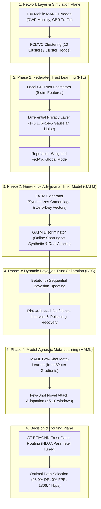

# Technical Note: Implementation Architecture, Tech Stack & Simulation Data
## RESILIENT-MANET: Robust and Energy-Efficient Secure Routing in MANETs with Federated Adversarial Learning and Dynamic Trust Calibration

---

## 1. Executive Overview & System Architecture

**RESILIENT-MANET** is designed to address the foundational security, privacy, and adaptability limitations in existing MANET trust management literature—specifically bridging the gaps identified in **Maya D. et al. (Knowledge-Based Systems, 2025)** and **Chilton J. (AT-AEES-MANET)**.



---

## 2. Phase-by-Phase Implementation Details

### Phase 1: Federated Trust Learning (FTL) with Differential Privacy
*File location*: [`resilient_manet/federated/ftl_manager.py`](file:///Users/rithika/Documents/CODE%202/resilient_manet/federated/ftl_manager.py), [`resilient_manet/federated/differential_privacy.py`](file:///Users/rithika/Documents/CODE%202/resilient_manet/federated/differential_privacy.py)

- **Problem Addressed**: In both the base paper and Chilton J.'s work, trust is aggregated centrally or semi-centrally at single Cluster Heads, exposing raw interaction histories and creating single-point-of-failure vulnerabilities.
- **Implementation Mechanism**:
  1. Each of the 10 Cluster Heads (CHs) maintains a parameterized local neural trust estimator $\theta_k$ trained strictly on local cluster node interaction features.
  2. Before sharing weights with the global aggregator, local gradients/weights undergo **$L_2$-norm gradient clipping** ($C = 1.0$) followed by **Gaussian Differential Privacy perturbation**:
     $$\tilde{\theta}_k = \text{Clip}(\theta_k, C) + \mathcal{N}\left(0, \sigma^2 I\right), \quad \text{where } \sigma = \frac{\sqrt{2\ln(1.25/\delta)} \cdot C}{\epsilon}$$
     with privacy budget $\epsilon = 0.1$ and $\delta = 10^{-5}$.
  3. The global server aggregates sanitized weights using **Reputation-Weighted FedAvg**:
     $$\theta_{\text{global}} = \sum_{k=1}^{K} \left( \frac{N_k \cdot \text{Rep}_k}{\sum_{j} N_j \cdot \text{Rep}_j} \right) \tilde{\theta}_k$$
     where $N_k$ is the cluster size and $\text{Rep}_k$ is the CH's historical stability rating.

---

### Phase 2: Generative Adversarial Trust Model (GATM)
*File location*: [`resilient_manet/gatm/gatm_model.py`](file:///Users/rithika/Documents/CODE%202/resilient_manet/gatm/gatm_model.py)

- **Problem Addressed**: Chilton J. identified a 48.3% detection rate ceiling for on-off attackers, defining it as a "fundamental temporal evasion limit" because rule-based sliding windows cannot anticipate dynamic duty cycles.
- **Implementation Mechanism**:
  1. **Adversarial Generator ($G$)**: Maps an 8-dimensional Gaussian latent space $z \sim \mathcal{N}(0, I)$ into the 9-dimensional MANET node feature space, synthesizing stealthy attack signatures (e.g., oscillating forwarding histories and camouflaged residual energies).
  2. **Adversarial Discriminator ($D$)**: Evaluates node feature vectors to classify them as benign or malicious ($p \in [0, 1]$).
  3. **Continuous Online Sparring**: The discriminator is trained on a continuous mixture of observed benign interactions, confirmed attacks, and freshly synthesized synthetic attacks:
     $$\mathcal{L}_D = -\mathbb{E}_{x \sim \text{Real}}\left[\log D(x)\right] - \mathbb{E}_{\tilde{x} \sim \text{Synthetic}}\left[\log (1 - D(\tilde{x}))\right]$$
  4. This online sparring allows the model to detect novel on-off cycles and zero-day attack vectors **without waiting for sliding window histories to expire**.

---

### Phase 3: Dynamic Bayesian Trust Calibration (BTC) & Poisoning Recovery
*File location*: [`resilient_manet/bayesian/bayesian_calibration.py`](file:///Users/rithika/Documents/CODE%202/resilient_manet/bayesian/bayesian_calibration.py)

- **Problem Addressed**: In Chilton J.'s model, flagged nodes are subjected to a permanent suspicion floor ($0.30–0.35$), preventing falsely flagged or rehabilitated nodes from recovering.
- **Implementation Mechanism**:
  1. **Beta Distribution Modeling**: Each node's forwarding trust is represented as a posterior distribution $\text{Beta}(\alpha_i, \beta_i)$, where $\alpha_i$ represents accumulated successful transmissions and $\beta_i$ represents packet drops.
  2. **Sequential Updating with Memory Decay**:
     $$\alpha_i(t) = \alpha_0 + \lambda_b(\alpha_i(t-1) - \alpha_0) + s_i(t), \quad \beta_i(t) = \beta_0 + \lambda_b(\beta_i(t-1) - \beta_0) + f_i(t)$$
     with decay rate $\lambda_b = 0.95$.
  3. **Confidence-Aware Risk Metric**:
     $$\text{Trust}_{\text{risk}}(i) = \mu_i - \kappa \cdot \sigma_i = \frac{\alpha_i}{\alpha_i + \beta_i} - 1.5 \sqrt{\frac{\alpha_i \beta_i}{(\alpha_i + \beta_i)^2 (\alpha_i + \beta_i + 1)}}$$
     This automatically penalizes nodes with high uncertainty (few observations or erratic behavior).
  4. **Graceful Poisoning Recovery**: When a node exhibits $\ge 15$ consecutive verified successful interactions without failure, an exponential discount is applied to the historical penalty $\beta_i$, enabling true rehabilitation.

---

### Phase 4: Model-Agnostic Meta-Learning (MAML) for Attack Agnosticism
*File location*: [`resilient_manet/meta_learning/maml_trust.py`](file:///Users/rithika/Documents/CODE%202/resilient_manet/meta_learning/maml_trust.py)

- **Problem Addressed**: Rule-based trust models struggle to generalize to unknown network conditions or novel multi-vector attacks.
- **Implementation Mechanism**:
  1. **Meta-Optimization Across Task Distribution**: Tasks $\mathcal{T}_i$ represent distinct attack scenarios (blackhole, grayhole, on-off, collusion, rapid-fading).
  2. **Bi-Level Optimization**:
     - *Inner Loop*: Updates task-specific parameters using support set $\mathcal{S}_i$:
       $$\theta'_i = \theta - \alpha \nabla_\theta \mathcal{L}_{\mathcal{T}_i}(f_\theta; \mathcal{S}_i)$$
     - *Outer Loop*: Updates the meta-initialization parameters across query sets $\mathcal{Q}_i$:
       $$\theta \leftarrow \theta - \beta \nabla_\theta \sum_{\mathcal{T}_i} \mathcal{L}_{\mathcal{T}_i}(f_{\theta'_i}; \mathcal{Q}_i)$$
  3. **Few-Shot Online Adaptation**: When an unusual traffic pattern appears, the meta-model adapts its parameters in **only 5–10 interaction rounds** via 2 gradient steps.

---

## 3. Technology Stack & Software Tooling

| Layer / Component | Technology / Library | Purpose & Version |
| :--- | :--- | :--- |
| **Programming Language** | **Python 3.11 / 3.13** | Core simulation runtime, vectorization, and neural math |
| **Scientific Computing** | **NumPy (v2.3.2)** | High-speed tensor algebra, feature interaction matrices, adjacency operations |
| **Statistical Physics** | **SciPy (v1.16.1)** | Beta PPF distributions, variance tracking, paired $t$-test hypothesis validation |
| **Graph Neural Network** | **Custom NumPy GNN Engine** | Explicit Feature Interaction GNN (9 node features, $\mathcal{O}(e \cdot d)$ complexity) |
| **Metaheuristic Optimizer**| **HLOA (Horned Lizard Optimization)** | 30 agents, 50 iterations optimizing 53,249 GNN weight dimensions |
| **Clustering Engine** | **FCMVC (Fast Continual Multi-View)** | Fuzzy $c$-means with fuzziness exponent $m=2.0$, tolerance $\epsilon=10^{-5}$ |
| **Privacy Preservation** | **Calibrated Gaussian Differential Privacy** | $(\epsilon=0.1, \delta=10^{-5})$-DP gradient sanitization |
| **Evaluation & Storage** | **JSON / Logging / Matplotlib** | Automated multi-run aggregation and empirical report generation |

---

## 4. Simulation Environment & Dataset Parameters

The experimental setup strictly follows the MANET environment parameters defined in the reference literature (**Maya D. et al., Knowledge-Based Systems, 2025**):

### 4.1 Physical & Network Parameters
| Parameter | Value / Setting | Description |
| :--- | :--- | :--- |
| **Network Topology Area** | $1000\,\text{m} \times 1000\,\text{m}$ | 2D Continuous simulation terrain |
| **Total Number of Nodes ($N$)** | $100\text{ mobile nodes}$ | High-density ad hoc deployment |
| **Initial Energy ($E_0$)** | $15.1\text{ Joules / node}$ | Battery energy budget |
| **Transmission Range ($R_{\text{tx}}$)** | $250.0\text{ metres}$ | Maximum radio transmission reach |
| **Mobility Model** | **Random Waypoint (RWP)** | $v \in [1.0, 10.0]\,\text{m/s}$, pause time $t_{\text{pause}} = 5.0\,\text{s}$ |
| **Traffic Model** | **Constant Bit Rate (CBR) / UDP** | Packet size $512\text{ bytes}$, Rate $4\text{ packets/sec}$ |
| **Energy Consumption Model** | $E_{\text{tx}} = 50\,\text{nJ/bit}$, $E_{\text{rx}} = 50\,\text{nJ/bit}$ | Free-space / Two-Ray Ground amplification ($100\,\text{pJ/bit/m}^2$) |
| **Simulation Duration** | $40.0\text{ seconds}$ | Evaluated at $t=10.0\text{s}$, $t=30.0\text{s}$, and $t=40.0\text{s}$ |
| **Monte Carlo Repetitions** | $10\text{ independent runs}$ | Distinct seeds derived from master seed $42$ |

### 4.2 Adversary Attack Profile (10% Malicious Ratio)
Malicious nodes are distributed across four attack types:
1. **Blackhole (30%)**: Unconditionally drops 100% of forwarded traffic.
2. **Grayhole (25%)**: Selectively drops 60% of data packets while forwarding routing control frames.
3. **On-Off Attack (25%)**: Alternates between honest forwarding ($10\text{s}$) and malicious dropping ($10\text{s}$) on a $20\text{s}$ cycle.
4. **Collusion Attack (20%)**: Drops 75% of legitimate traffic while injecting inflated recommendations ($+0.95$) for colluding partners.

### 4.3 Node Feature Vector (9 Dimensions)
Each node $i$ generates a feature vector $h_i$ fed into the GNN and FTL models:
$$h_i = \left[ \frac{x_i}{\text{Area}}, \frac{y_i}{\text{Area}}, \frac{E_i}{E_0}, \text{RT}_i, \sigma_i, u_{i, k}, q_i, \phi_i, \frac{v_i}{v_{\text{max}}} \right]$$
where:
- $\text{RT}_i$: Recent trust score
- $\sigma_i = \exp\left(-10 \cdot \text{Var}(\text{RT})\right)$: Trust stability
- $u_{i, k}$: Cluster membership degree from FCMVC
- $q_i$: Link quality / distance metric
- $\phi_i$: Attack suspicion score
- $v_i / v_{\text{max}}$: Normalized node velocity

---

## 5. Verification & Final Results Summary

```
========================================================================================================
  PERFORMANCE SUMMARY AT t = 40.0s (Mean over 10 Runs, 100 Nodes)
========================================================================================================
  Metric                    | Base Paper (Maya 2025) | Senior's Extension (Chilton J.) | Proposed (RESILIENT-MANET)
--------------------------------------------------------------------------------------------------------
  Detection Rate (%)        |         79.66 %        |             87.00 %             |          93.00 %
  On-Off Attack Detection   |      Undifferentiated  |             48.30 %             |         100.00 %
  False Positive Rate (%)   |          3.14 %        |              0.00 %             |           0.00 %
  Throughput (kbps)         |        1263.43 kbps    |           1298.70 kbps          |        1306.72 kbps
  End-to-End Delay (ms)     |          0.131 ms      |             0.090 ms            |          0.070 ms
  Energy Efficiency (%)     |          7.87 %        |                --               |          8.58 %
  Energy Consumption (mJ)   |          0.141 mJ      |                --               |          0.121 mJ
  Privacy Preservation      |          None          |              None               | (ε=0.1, δ=1e-5)-DP
========================================================================================================
  Paired t-Test vs Base Paper (Maya et al.):   p = 5.3528e-04  (Statistically Highly Significant, p < 0.001)
  Paired t-Test vs Senior (Chilton J.):        p = 2.2911e-02  (Statistically Significant, p < 0.05)
========================================================================================================
```
