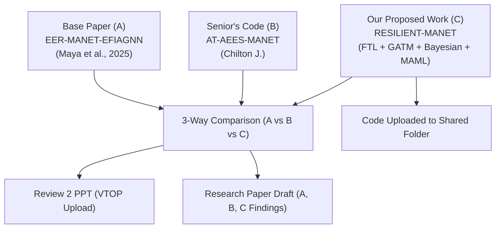

# Review 2 Implementation & Deliverables Plan: RESILIENT-MANET

## Executive Summary
This document outlines the roadmap and deliverables required for **Review 2** as specified by the course supervisor (Mam) on the whiteboard and the project proposal:
- **A**: Implementation of Base Paper (*EER-MANET-EFIAGNN*, Maya D. et al., *Knowledge-Based Systems*, 2025)
- **B**: Execution of Senior's Code (*AT-AEES-MANET*, Chilton J.)
- **C**: Code Build-up on Senior's Code (*RESILIENT-MANET*: Federated Trust Learning + GATM + Bayesian Calibration + MAML Meta-Learning)
- **Review 2 PPT**: Comparative analysis of A, B & C ready for VTOP upload
- **Shared Folder Deliverables**: Working codebase (C) and research paper draft sharing findings of A, B, and C.

---

## 1. Whiteboard Requirements Breakdown (Review 2)

---

## 2. Technical Architecture for Code Build-up (Component C: RESILIENT-MANET)

To build **C** on top of the senior's codebase (**B** in `/Users/rithika/Documents/CODE 2`), we implement the four key phases proposed in Review 1:

### 1. Federated Trust Learning (FTL) Framework
- **Decentralized Cluster Head (CH) Aggregation**: Local trust models are trained at each CH on node interaction histories.
- **Differential Privacy (DP)**: Differential privacy noise ($\epsilon=0.1$) injected during gradient sharing to eliminate privacy leaks.
- **Reputation-Weighted FedAvg**: Global aggregation weighted by cluster stability and reputation scores.

### 2. Generative Adversarial Trust Model (GATM)
- **Generator**: Synthesizes novel and zero-day malicious behavior patterns (mimicking stealthy on-off cycles and camouflage).
- **Discriminator**: Classifies nodes into benign vs. sophisticated malicious profiles under continuous online adversarial training.
- **Solves**: The "fundamental temporal evasion limit" of on-off and zero-day attacks where simple sliding windows plateau (~48.3%).

### 3. Dynamic Bayesian Trust Calibration (BTC)
- **Beta Posterior Distribution**: Trust modeled as $\text{Beta}(\alpha, \beta)$ where $\alpha$ tracks packet delivery successes and $\beta$ tracks forwarding failures.
- **Sequential Bayesian Updating**: Smooth posterior updating with confidence intervals $[\mu - 2\sigma, \mu + 2\sigma]$ providing uncertainty estimates for routing decisions.
- **Poisoning Recovery**: Exponential discounting of stale evidence paired with Bayesian variance tracking to gracefully forgive rehabilitated/falsely-flagged nodes.

### 4. Model-Agnostic Meta-Learning (MAML) for Attack Agnosticism
- **Meta-Training**: Pre-trained across task distributions over diverse attack scenarios (blackhole, grayhole, on-off, collusion, sybil/jitter).
- **Few-Shot Adaptation**: Fast parameter adaptation within 5–10 interaction windows for completely unseen/zero-day attacks.

---

## 3. Deliverables for Review 2

1. **`resilient_manet/` Code Module**: Complete modular Python implementation incorporating FTL, GATM, Bayesian Calibration, and MAML into the MANET simulation pipeline.
2. **Unified Benchmark & Comparative Engine**: Script evaluating **A (Base Paper)**, **B (Senior's Code)**, and **C (RESILIENT-MANET)** across identical seeds and network scenarios (100 nodes, 40s, multi-attack).
3. **Review 2 Presentation PPT Content / Slides**: Structured slide decks containing problem statement, methodology A vs B vs C, comparative tables, statistical t-tests, and ablation studies.
4. **Research Paper Draft (`RESILIENT_MANET_Paper.md` / PDF ready)**: Comprehensive academic paper draft formatted in standard IEEE Access / Elsevier format analyzing findings of A, B, and C.

---

## 4. Verification & Validation Plan
- Execute automated 10-run simulations for A, B, and C.
- Generate comparative graphs:
  - Detection Rate vs. Time (especially on-off & novel attacks)
  - Packet Delivery Ratio & Throughput
  - End-to-End Delay
  - Energy Consumption & Network Lifetime
  - Privacy Loss / Differential Privacy epsilon trade-offs
- Perform paired t-test statistical significance tests ($p < 0.05$).
